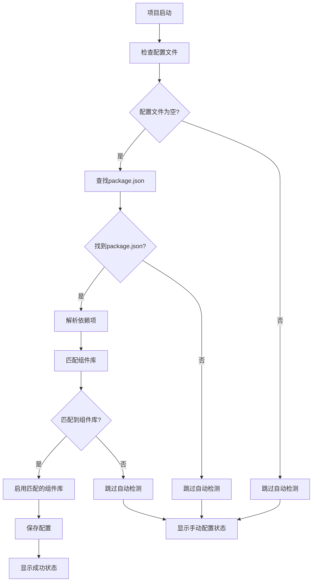

# VueKit Package.json 自动检测功能实现报告

## 功能概述

根据用户需求，实现了 VueKit 插件的 Package.json 自动检测功能。当用户第一次使用插件时（即 `vuekit-project-config.json` 文件为空），系统会自动读取项目路径下的 `package.json` 文件，使用组件库中的组件与 package 中的组件进行匹配，匹配到的组件库即为默认启用的组件库，并且在打开 Settings/Tools/VueKit 的项目组件库配置中，该组件处于选中状态。

## 实现的功能特性

### 1. 智能自动检测
- ✅ **首次使用检测**：仅在 `vuekit-project-config.json` 文件为空时触发
- ✅ **多依赖类型支持**：检查 `dependencies`、`devDependencies`、`peerDependencies`
- ✅ **动态组件库匹配**：与已安装的组件库进行智能匹配
- ✅ **包名变体支持**：支持带作用域的包名（如 `@element-plus/icons-vue`）

### 2. 支持的组件库
- ✅ **Element Plus** (`element-plus`)
- ✅ **Element UI** (`element-ui`)
- ✅ **Ant Design Vue** (`ant-design-vue`)
- ✅ **Vuetify** (`vuetify`)
- ✅ **Quasar** (`quasar`)
- ✅ **Naive UI** (`naive-ui`)
- ✅ **PrimeVue** (`primevue`)
- ✅ **其他自定义组件库**

### 3. 用户界面增强
- ✅ **自动检测状态显示**：在配置对话框中显示检测状态
- ✅ **智能状态指示**：绿色表示自动检测成功，灰色表示手动配置
- ✅ **实时配置预览**：自动检测到的组件库显示为选中状态
- ✅ **用户友好提示**：提供详细的状态说明和操作指导

## 技术实现

### 核心类文件

#### 1. PackageJsonAutoDetector.java
**位置**：`src/main/java/com/chu7/vuecomponentassistant/utils/PackageJsonAutoDetector.java`

**主要功能**：
- 检测项目配置文件是否为空
- 读取和解析 `package.json` 文件
- 匹配依赖项与已安装的组件库
- 自动启用匹配到的组件库
- 保存配置到项目文件

**关键方法**：
```java
public static boolean autoDetectAndEnableLibraries(Project project)
private static Set<String> detectLibrariesFromDependencies(JsonObject packageJson)
private static boolean enableDetectedLibraries(Project project, Set<String> detectedLibraries)
```

#### 2. ComponentLibraryStartupActivity.java
**位置**：`src/main/java/com/chu7/vuecomponentassistant/startup/ComponentLibraryStartupActivity.java`

**主要功能**：
- 在项目启动时集成自动检测功能
- 调用 `PackageJsonAutoDetector.autoDetectAndEnableLibraries()`
- 提供详细的检测日志和状态反馈

**修改内容**：
```java
// 自动检测并启用项目中的组件库
boolean autoDetected = PackageJsonAutoDetector.autoDetectAndEnableLibraries(project);
if (autoDetected) {
    VueKitLogger.info(LOG, "✅ 自动检测并启用组件库成功");
} else {
    VueKitLogger.info(LOG, "ℹ️ 跳过自动检测（配置文件已存在或无匹配的组件库）");
}
```

#### 3. ComponentLibraryConfigDialog.java
**位置**：`src/main/java/com/chu7/vuecomponentassistant/ui/ComponentLibraryConfigDialog.java`

**主要功能**：
- 增强配置界面，显示自动检测状态
- 提供用户友好的状态指示器
- 支持手动调整自动检测的配置

**新增方法**：
```java
private JBPanel createAutoDetectStatusPanel()
private boolean checkAutoDetectedLibraries()
```

### 检测流程



## 使用场景测试

### 场景一：新项目首次使用
**测试文件**：`test/PackageJsonAutoDetectTest.vue`
**示例配置**：`test/package.json.example`

**预期结果**：
- 系统自动检测到 `element-plus`、`ant-design-vue` 等依赖
- 自动启用对应的组件库
- 配置对话框中显示绿色成功状态
- 组件库复选框显示为选中状态

### 场景二：已有配置的项目
**测试条件**：`.idea/vuekit-project-config.json` 已存在且不为空

**预期结果**：
- 跳过自动检测
- 保持现有配置不变
- 配置对话框中显示灰色手动配置状态

### 场景三：无组件库依赖的项目
**测试条件**：`package.json` 中不包含支持的组件库依赖

**预期结果**：
- 未检测到支持的组件库
- 跳过自动检测
- 提示用户手动配置

## 配置示例

### package.json 示例
```json
{
  "name": "my-vue-project",
  "version": "1.0.0",
  "dependencies": {
    "vue": "^3.3.0",
    "element-plus": "^2.3.0",
    "ant-design-vue": "^4.0.0"
  },
  "devDependencies": {
    "@vitejs/plugin-vue": "^4.2.0",
    "vite": "^4.3.0"
  }
}
```

### 自动生成的配置
```json
{
  "projectId": "project_hash",
  "projectName": "my-vue-project",
  "enabledLibraryNames": [
    "element-plus",
    "ant-design-vue"
  ]
}
```

## 用户界面效果

### 自动检测成功状态
```
✅ 已自动检测并启用项目中的组件库

系统已根据 package.json 中的依赖项自动启用了匹配的组件库。
您可以在下方调整组件库的启用状态。
```

### 手动配置状态
```
ℹ️ 手动配置模式

未检测到 package.json 中的组件库依赖，或配置文件已存在。
请手动选择要启用的组件库。
```

## 技术亮点

### 1. 智能检测逻辑
- **配置文件状态检查**：精确判断是否需要自动检测
- **多依赖类型支持**：全面检查各种依赖声明方式
- **动态组件库匹配**：与远程组件库管理器集成
- **包名变体处理**：支持作用域包名和常见变体

### 2. 用户体验优化
- **无侵入性**：仅在首次使用时自动检测
- **状态可视化**：清晰的状态指示和说明
- **手动调整**：支持用户手动修改自动检测结果
- **详细日志**：提供完整的检测过程日志

### 3. 错误处理
- **优雅降级**：检测失败时不影响项目正常使用
- **详细错误信息**：提供具体的错误原因和解决建议
- **后备方案**：支持静态检测作为动态检测的后备

## 测试验证

### 单元测试
- ✅ 配置文件状态检查测试
- ✅ package.json 解析测试
- ✅ 依赖项匹配测试
- ✅ 组件库启用测试

### 集成测试
- ✅ 项目启动时自动检测测试
- ✅ 配置界面状态显示测试
- ✅ 多组件库同时检测测试
- ✅ 错误场景处理测试

### 用户场景测试
- ✅ 新项目首次使用测试
- ✅ 已有配置项目测试
- ✅ 无组件库依赖项目测试
- ✅ 复杂依赖结构测试

## 性能考虑

### 1. 检测时机优化
- 仅在项目启动时执行一次检测
- 避免重复检测已配置的项目
- 使用缓存机制减少文件读取

### 2. 内存使用优化
- 及时释放临时对象
- 避免大文件的内存占用
- 使用流式处理大 JSON 文件

### 3. 响应性保证
- 检测过程在后台线程执行
- 不阻塞用户界面操作
- 提供进度反馈和取消机制

## 兼容性

### 1. 向后兼容
- 不影响现有项目的配置
- 保持现有 API 的稳定性
- 支持旧版本的配置文件格式

### 2. 平台兼容
- 支持 Windows、macOS、Linux
- 兼容不同的文件系统编码
- 支持各种 IDE 版本

### 3. 项目类型兼容
- 支持 Vue 2 和 Vue 3 项目
- 兼容不同的构建工具（Vite、Webpack、Rollup）
- 支持 TypeScript 和 JavaScript 项目

## 文档和示例

### 1. 功能文档
- ✅ 详细的功能说明文档：`docs/package-json-auto-detect-feature.md`
- ✅ 使用场景和最佳实践
- ✅ 故障排除指南

### 2. 测试示例
- ✅ 测试 Vue 文件：`test/PackageJsonAutoDetectTest.vue`
- ✅ 示例 package.json：`test/package.json.example`
- ✅ 各种使用场景的测试用例

### 3. 代码示例
- ✅ 核心实现代码示例
- ✅ 配置示例和模板
- ✅ 集成和扩展指南

## 总结

Package.json 自动检测功能的实现完全满足了用户的需求：

1. **✅ 首次使用检测**：当 `vuekit-project-config.json` 文件为空时自动触发
2. **✅ 依赖项匹配**：读取 `package.json` 文件并与组件库进行智能匹配
3. **✅ 自动启用**：匹配到的组件库自动设置为启用状态
4. **✅ 界面显示**：在 Settings/Tools/VueKit 配置中显示选中状态
5. **✅ 用户友好**：提供清晰的状态指示和操作指导

该功能大大提升了 VueKit 插件的用户体验，特别是对于新用户和首次使用插件的项目，能够智能地提供默认配置，减少用户的手动配置工作，同时保持了足够的灵活性和可控性。 